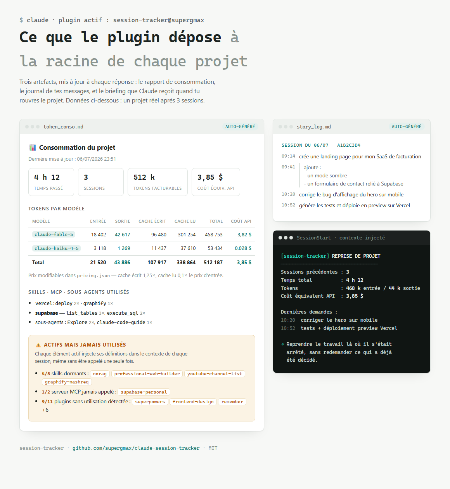
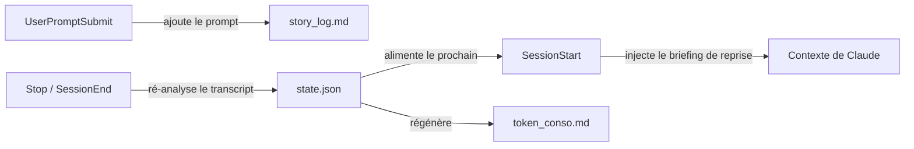

<div align="center">

# 📊 Session Tracker

### La vision aux rayons X de votre consommation Claude Code

[English](README.md) · **Français**

[](https://code.claude.com/docs/en/plugins)
[](LICENSE)
[](https://nodejs.org)
[](https://github.com/supergmax/claude-session-tracker/pulls)

*Combien de tokens ce projet a-t-il vraiment coûté ? Sur quel modèle ? Combien de temps j'y ai passé ?*
*Et combien de mes skills, serveurs MCP et plugins dorment dans le contexte en brûlant des tokens pour rien ?*

**Session Tracker répond à tout ça — automatiquement, dans chaque projet, en Markdown.**

<picture>
  <source media="(prefers-color-scheme: dark)" srcset="assets/preview-dark.png">
  
</picture>

</div>

---

## ✨ Ce que vous obtenez

Une fois installé, chaque projet Claude Code maintient automatiquement deux rapports vivants à sa racine :

| Fichier | Contenu |
|---|---|
| 📊 **`token_conso.md`** | Le compte exact des tokens (entrée / sortie / cache écrit / cache lu) **par modèle**, le **coût équivalent API en $** (liste de prix modifiable), le **temps total passé sur le projet**, le détail par session, tout ce que vous avez **réellement utilisé** (skills, outils MCP, sous-agents, plugins)… et tout ce qui est **actif mais jamais utilisé** — votre gaspillage de tokens. |
| 📖 **`story_log.md`** | Le journal horodaté de **tous les messages que vous avez envoyés**, groupés par session. L'histoire de votre projet, racontée par vos propres prompts. |
| 📈 **`token_dashboard.html`** | Les mêmes données en **tableau de bord local** : ouvrez-le dans votre navigateur, rafraîchissez après chaque réponse. Généré par les hooks eux-mêmes — **zéro token supplémentaire**, pas de cloud, pas d'artifact. Désactivable avec `{"dashboard": false}` dans `.claude/session-tracker/config.json` si vous ne voulez que le Markdown. |

Plus un superpouvoir invisible :

> 🔄 **Reprise de projet** — rouvrez un projet des jours plus tard et Claude reçoit instantanément un briefing : temps passé, totaux de tokens, et vos 5 dernières demandes. Il reprend là où vous vous étiez arrêté au lieu de vous faire tout répéter.

## 📸 Exemple de rapport

Un vrai `token_conso.md` ressemble à ça :

> - **Temps total passé sur le projet** : 4 h 12 min · **Sessions** : 3
> - **Coût équivalent API** : **3,85 $** *(ce que ce projet aurait coûté au tarif public de l'API)*
>
> ## Tokens par modèle
>
> | Modèle | Entrée | Sortie | Cache écrit | Cache lu | Total facturable | Coût API |
> |---|---:|---:|---:|---:|---:|---:|
> | `claude-fable-5` | 18 402 | 42 617 | 96 480 | 301 254 | 458 753 | 3,82 $ |
> | `claude-haiku-4-5` | 3 118 | 1 269 | 11 437 | 37 610 | 53 434 | 0,028 $ |
> | **Total** | **21 520** | **43 886** | **107 917** | **338 864** | **512 187** | **3,85 $** |
>
> ## ⚠️ Actifs mais JAMAIS utilisés (gaspillage potentiel de tokens)
>
> - **Skills actifs jamais utilisés** (4/5 détectés) : `norag`, `professional-web-builder`, …
> - **Serveurs MCP configurés jamais appelés** (1/1) : `supabase-personal`
> - **Plugins activés sans utilisation détectée** (9/11) : `superpowers`, `frontend-design`, …

Cette dernière section est celle qui rembourse le plugin : chaque skill, serveur MCP ou plugin actif injecte ses descriptions et définitions d'outils dans le contexte de **chaque session** — même si vous ne l'appelez jamais. Session Tracker vous montre exactement quoi désactiver.

## 💵 Estimation du coût API

Chaque rapport indique ce que le projet **aurait coûté via l'API**, par modèle et par session — calculé depuis une **liste de prix modifiable** (USD par million de tokens, écriture cache à 1,25× l'entrée, lecture cache à 0,1×) :

- Les prix par défaut sont livrés avec le plugin (tarifs publics Anthropic, juillet 2026).
- Surcharge globale dans `~/.claude/session-tracker/pricing.json` (créé automatiquement au premier lancement, jamais écrasé).
- Surcharge par projet dans `<projet>/.claude/session-tracker/pricing.json`.

Les modèles sont reconnus par plus long préfixe de nom : `claude-haiku-4-5-20251001` utilise le tarif `claude-haiku-4-5`. Nouveau modèle ? Ajoutez une ligne au JSON. Le rapport affiche la table de prix exacte utilisée, avec un ✓ sur les tarifs réellement appliqués à votre projet.

> ℹ️ Avec un abonnement Claude Code vous ne payez pas ces montants — c'est la valeur *équivalent API* de votre consommation, et c'est justement ce qui en fait un excellent détecteur de gaspillage.

## 🚀 Installation

Dans Claude Code :

```
/plugin marketplace add supergmax/claude-session-tracker
/plugin install session-tracker@supergmax
```

C'est tout. Il tourne désormais dans **tous** vos projets — chacun avec ses propres rapports et son propre état de reprise.

<details>
<summary><b>Installation locale / développement</b></summary>

```bash
# Test ponctuel (une seule session)
claude --plugin-dir /chemin/vers/claude-session-tracker

# Ou ajoutez votre clone local comme marketplace
/plugin marketplace add /chemin/vers/claude-session-tracker
/plugin install session-tracker@supergmax
```

</details>

**Prérequis :** [Node.js](https://nodejs.org) ≥ 18 dans le `PATH` (les hooks sont de simples scripts Node — aucune dépendance, rien à `npm install`).

## ⚙️ Fonctionnement

Quatre [hooks](https://code.claude.com/docs/en/hooks) légers, zéro dépendance, zéro appel réseau :



| Hook | Action |
|---|---|
| `SessionStart` | Enregistre la session ; sur `startup`/`resume` avec un historique, injecte le briefing de reprise (jamais après `/clear` ni un compactage). |
| `UserPromptSubmit` | Ajoute votre message à `story_log.md` et à l'état de reprise. |
| `Stop` | Ré-analyse le transcript complet de la session (idempotent — aucun double comptage) et régénère `token_conso.md`. |
| `SessionEnd` | Idem, puis marque la session comme terminée. |

Les tokens sont lus directement dans le transcript officiel de la session (`message.usage`), dédoublonnés par id de message. Les sous-agents (sidechains) sont comptés aussi — ils consomment de vrais tokens.

**Détection utilisation vs gaspillage :**

- **Utilisé** = un appel réel trouvé dans le transcript : invocations de `Skill`, appels `mcp__serveur__outil`, sous-agents, plugins déduits des skills `plugin:skill` et des serveurs `mcp__plugin_*`.
- **Actif** = ce qui est configuré sur votre machine : `~/.claude/skills` + skills du projet, `enabledPlugins` des settings, serveurs MCP de `~/.claude.json` et `.mcp.json`.
- Le rapport liste la différence. C'est votre gaspillage.

## 📁 Fichiers générés & confidentialité

```
votre-projet/
├── token_conso.md                      # 📊 le rapport de consommation
├── token_dashboard.html                # 📈 le dashboard local (optionnel, zéro token)
├── story_log.md                        # 📖 le journal de vos prompts
└── .claude/session-tracker/
    ├── state.json                      # état de reprise (local, par projet)
    ├── config.json                     # optionnel : {"dashboard": false}, prix par projet
    └── error.log                       # seulement si quelque chose a mal tourné
```

Tout reste **sur votre machine**. Pas de télémétrie, pas de réseau, pas de service externe. Ajoutez `.claude/session-tracker/` à votre `.gitignore` si vous ne voulez pas versionner l'état interne — versionner `token_conso.md` et `story_log.md` est en revanche souvent très utile.

## ⚠️ Limites connues

- Le format du transcript est interne à Claude Code et peut changer entre versions. Le parsing est défensif : les lignes illisibles sont ignorées et toute erreur part dans `error.log` — un hook ne **cassera jamais votre session**.
- Un plugin qui n'agit que par hooks (sans skill ni MCP) peut apparaître à tort comme « non utilisé ».
- Temps passé = de la première à la dernière activité de chaque session ; une session laissée ouverte toute la nuit ne gonfle pas vos totaux.

## 🤝 Contribuer

Issues et PRs bienvenues ! Des idées qui iraient bien : estimation du coût en $ par modèle, dashboard HTML, synthèses hebdomadaires, attribution des tokens par outil.

## 📄 Licence

[MIT](LICENSE) © [supergmax](https://github.com/supergmax)

---

<div align="center">

*Construit avec Claude Code, pour Claude Code.* 🤖

</div>
