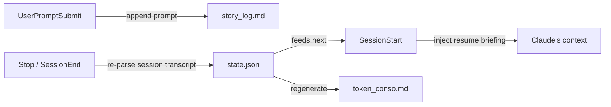

<div align="center">

# 📊 Session Tracker

### X-ray vision for your Claude Code usage

**English** · [Français](README.fr.md)

[](https://code.claude.com/docs/en/plugins)
[](LICENSE)
[](https://nodejs.org)
[](https://github.com/supergmax/claude-session-tracker/pulls)

*How many tokens did this project really cost? On which model? How much time did I spend on it?*
*And how many of my skills, MCP servers and plugins are just sitting there, burning context for nothing?*

**Session Tracker answers all of that — automatically, in every project, in plain Markdown.**

<picture>
  <source media="(prefers-color-scheme: dark)" srcset="assets/preview-dark.png">
  
</picture>

</div>

---

## ✨ What you get

Once installed, every Claude Code project automatically maintains two living reports at its root:

| File | What's inside |
|---|---|
| 📊 **`token_conso.md`** | Exact token counts (input / output / cache write / cache read) **per model**, the **equivalent API cost in $** (editable price list), total **time spent on the project**, a per-session breakdown, everything you **actually used** (skills, MCP tools, subagents, plugins)… and everything that is **active but never used** — your token waste. |
| 📖 **`story_log.md`** | A timestamped log of **every message you sent**, grouped by session. Your project's story, told through your own prompts. |

Plus one invisible superpower:

> 🔄 **Project resume** — reopen a project days later and Claude instantly receives a briefing: time spent so far, token totals, and your last 5 requests. It picks up where you left off instead of asking you to repeat yourself.

## 📸 Sample report

A real `token_conso.md` looks like this:

> ## Tokens by model
>
> | Model | Input | Output | Cache write | Cache read | Billable total | Calls |
> |---|---:|---:|---:|---:|---:|---:|
> | `claude-fable-5` | 3,600 | 1,060 | 8,700 | 24,000 | 37,360 | 3 |
> | `claude-haiku-4-5` | 400 | 80 | 0 | 0 | 480 | 1 |
> | **Total** | **4,000** | **1,140** | **8,700** | **24,000** | **37,840** | **4** |
>
> ## ⚠️ Active but NEVER used (potential token waste)
>
> - **Unused active skills** (4/5 detected): `norag`, `professional-web-builder`, …
> - **Configured MCP servers never called** (1/1): `supabase-personal`
> - **Enabled plugins with no detected usage** (9/11): `superpowers`, `frontend-design`, …

That last section is the one that pays for itself: every active skill, MCP server or plugin injects its descriptions and tool definitions into the context of **every single session** — even when you never call it. Session Tracker shows you exactly what to disable.

## 💵 API cost estimation

Every report includes what the project **would have cost through the API**, per model and per session — computed from an **editable price list** (USD per million tokens, cache writes at 1.25× input, cache reads at 0.1×):

- Defaults ship with the plugin (Anthropic's public pricing as of July 2026).
- Override globally in `~/.claude/session-tracker/pricing.json` (created for you on first run, never overwritten).
- Override per project in `<project>/.claude/session-tracker/pricing.json`.

Models are matched by longest name prefix, so `claude-haiku-4-5-20251001` picks up the `claude-haiku-4-5` price. New model? Just add a line to the JSON. The report shows the exact price table it used, with a ✓ next to the rates your project actually hit.

> ℹ️ On a Claude Code subscription you don't pay these amounts — it's the *API-equivalent* value of your usage, which is exactly what makes it a great waste detector.

## 🚀 Installation

Inside Claude Code:

```
/plugin marketplace add supergmax/claude-session-tracker
/plugin install session-tracker@supergmax
```

That's it. It now runs in **all** your projects — each one gets its own reports and its own resume state.

<details>
<summary><b>Local / development install</b></summary>

```bash
# One-off test (single session)
claude --plugin-dir /path/to/claude-session-tracker

# Or add your local clone as a marketplace
/plugin marketplace add /path/to/claude-session-tracker
/plugin install session-tracker@supergmax
```

</details>

**Requirements:** [Node.js](https://nodejs.org) ≥ 18 on your `PATH` (the hooks are plain Node scripts — no dependencies, nothing to `npm install`).

## ⚙️ How it works

Four lightweight [hooks](https://code.claude.com/docs/en/hooks), zero dependencies, zero network calls:



| Hook | Action |
|---|---|
| `SessionStart` | Registers the session; on `startup`/`resume` with prior history, injects the resume briefing (never after `/clear` or a compaction). |
| `UserPromptSubmit` | Appends your message to `story_log.md` and to the resume state. |
| `Stop` | Re-parses the full session transcript (idempotent — no double counting) and regenerates `token_conso.md`. |
| `SessionEnd` | Same, then marks the session as finished. |

Token counts come straight from the official session transcript (`message.usage`), deduplicated by message id. Subagent (sidechain) calls are counted too — they consume real tokens.

**Usage vs. waste detection:**

- **Used** = a real call found in the transcript: `Skill` invocations, `mcp__server__tool` calls, subagents, plugins inferred from `plugin:skill` names and `mcp__plugin_*` servers.
- **Active** = what's configured on your machine: `~/.claude/skills` + project skills, `enabledPlugins` from settings, MCP servers from `~/.claude.json` and `.mcp.json`.
- The report lists the difference. That's your waste.

## 📁 Generated files & privacy

```
your-project/
├── token_conso.md                      # 📊 the consumption report
├── story_log.md                        # 📖 your prompt log
└── .claude/session-tracker/
    ├── state.json                      # resume state (local, per project)
    └── error.log                       # only if something went wrong
```

Everything stays **on your machine**. No telemetry, no network, no external service. Add `.claude/session-tracker/` to your `.gitignore` if you don't want to version the internal state — committing `token_conso.md` and `story_log.md`, on the other hand, is often genuinely useful.

## ⚠️ Known limitations

- The transcript format is internal to Claude Code and may change between versions. Parsing is defensive: unreadable lines are skipped, and any error goes to `error.log` — a hook will **never break your session**.
- A plugin that only acts through hooks (no skills, no MCP) may wrongly appear as "unused".
- Time spent = first-to-last activity per session, so a session left open overnight doesn't inflate your totals.

## 🤝 Contributing

Issues and PRs welcome! Ideas that would fit right in: cost estimation in $ per model, HTML dashboard, weekly rollups, per-tool token attribution.

## 📄 License

[MIT](LICENSE) © [supergmax](https://github.com/supergmax)

---

<div align="center">

*Built with Claude Code, for Claude Code.* 🤖

</div>
